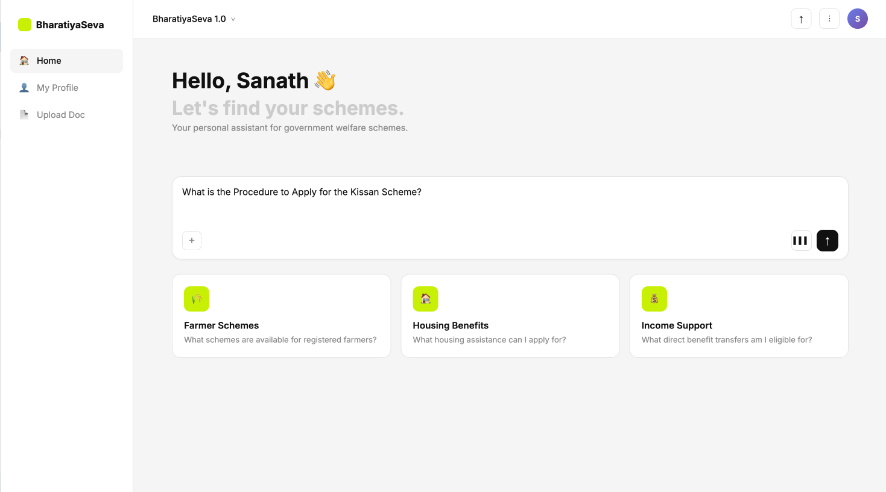
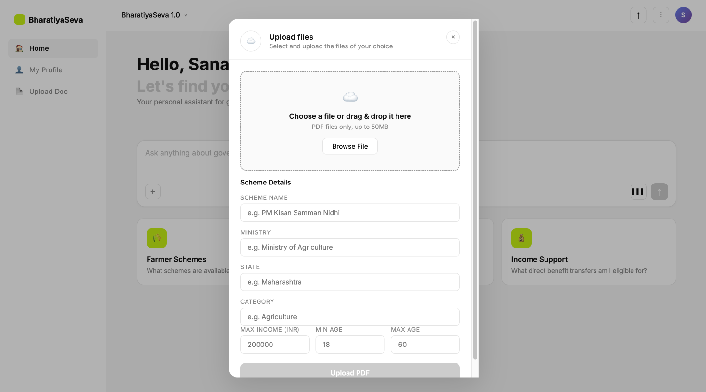
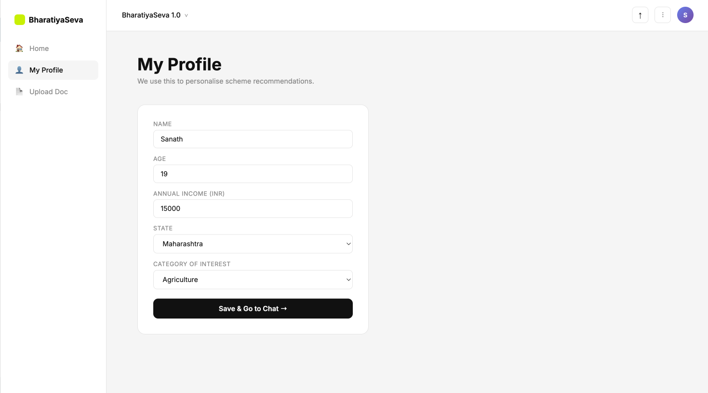

# BharatiyaSeva – Multimodal RAG for Government Scheme Discovery





Eligibility-driven QnA over Indian government welfare scheme PDFs.

---

## What is Bharatiya Seva RAG?

**Bharatiya Seva RAG** is a **Retrieval-Augmented Generation (RAG)** system designed to make Indian government welfare schemes easily searchable and understandable through natural language queries.

Government scheme documents are typically:

* Long, unstructured PDFs
* Filled with dense eligibility rules, benefits, and procedures
* Hard for citizens to navigate and interpret

This system solves that by:

* Parsing and structuring scheme documents
* Retrieving the most relevant information using hybrid search
* Generating precise, contextual answers using an LLM

### Use Case

A user can ask:

* *“Am I eligible for PM Kisan?”*
* *“What is the income limit for this scheme?”*
* *“Which schemes apply to farmers in Karnataka?”*

Instead of manually reading PDFs, the system:

1. Retrieves the most relevant sections
2. Understands context
3. Generates a clear, human-readable answer

### Why it’s Useful

* Reduces information access friction for citizens
* Enables intelligent discovery of welfare schemes
* Converts static documents into an interactive knowledge system
* Can scale to multiple ministries, states, and document types

---

## What’s Implemented So Far (Version 1)

This is a **minimal, production-ready RAG pipeline** with clean architecture and extensibility.

### Ingestion Pipeline

* **PDF Parsing** using PyMuPDF
* **Text Cleaning** to remove:

  * Unicode noise
  * Page numbers
  * Artifacts from government PDFs
* **Chunking Strategy**

  * Recursive Character Splitter (RCS)
  * Parent–Child chunking: **256 / 32**
* **Metadata Enrichment**

  * Added at schema level to every chunk

### Storage

* MongoDB collections:

  * `documents`
  * `chunks`
  * `users`
* Schema-driven storage design

### Embeddings

* Free local transformer model
* Sentence-transformers based embeddings

### Retrieval

* **Hybrid Retrieval**

  * BM25
  * Semantic similarity
  * Fusion via **RRF (Reciprocal Rank Fusion)**

### Vector Search

* MongoDB Atlas Vector Search

### APIs Implemented

* `POST /upload` → Upload document
* `POST /user` → Add user details
* `GET /user` → Retrieve user details
* `/query` → QnA over documents

### Summary

This version focuses on:

* Clean code structure
* Minimal working RAG system
* Production-ready baseline

---

## Future Enhancements (Upcoming Versions)

Planned improvements include:

### Ingestion

* Advanced chunking strategies
* Multimodal ingestion (CSV, images, structured data)

### Retrieval

* Query rewriting
* Query expansion
* MMR (Maximal Marginal Relevance)
* Multi-hop retrieval

### Ranking

* Reranker integration

### LLM Improvements

* Chain-of-thought prompting
* Structured prompts
* Context window optimization

### Performance

* Embedding quantization (SQ8)
* Caching (ingestion + query time)
* Deduplication via hashing

### Multi-Tenancy

* Tenant-based namespace isolation
* Index naming strategies

### Evaluation

* Metrics pipeline for RAG quality
* Retrieval + generation benchmarking

---

## Local Setup

### 1 – Install MongoDB Community (free, local)

**macOS**

```bash
brew tap mongodb/brew
brew install mongodb-community@7.0
brew services start mongodb-community@7.0
```

**Ubuntu / Debian**

```bash
sudo apt-get install -y mongodb
sudo systemctl start mongod
```

**Windows** – Download installer from [https://www.mongodb.com/try/download/community](https://www.mongodb.com/try/download/community)

Verify connection:

```bash
mongosh "mongodb://localhost:27017"
```

---

### 2 – Create the Vector Search Index

```js
use bharatiya_seva

db.chunks.createIndex(
  { "embedding": "vectorSearch" },
  {
    name: "vector_index",
    vectorSearchOptions: {
      numDimensions: 384,
      similarity: "cosine",
      type: "hnsw"
    }
  }
)
```

> Note: Atlas Vector Search on local MongoDB requires MongoDB 7.0+ with the Atlas CLI or a local Atlas deployment. Alternatively, swap MongoVectorRepository for a Chroma / Qdrant local adapter (stub in app/db/vectordb/client.py).

---

### 3 – Python Environment

```bash
python -m venv venv
source venv/bin/activate          # Windows: venv\Scripts\activate
pip install -r requirements.txt
```

---

### 4 – Environment Variables

```bash
cp .env .env.local
# Edit .env.local – at minimum set LLM_API_KEY
```

| Variable             | Default                                | Description             |
| -------------------- | -------------------------------------- | ----------------------- |
| MONGODB_URI          | mongodb://localhost:27017              | Local MongoDB           |
| MONGODB_DB_NAME      | bharatiya_seva                         | Database name           |
| EMBEDDING_MODEL_NAME | sentence-transformers/all-MiniLM-L6-v2 | Free HF model           |
| PARENT_CHUNK_SIZE    | 1024                                   | Parent chunk token size |
| CHILD_CHUNK_SIZE     | 256                                    | Child chunk token size  |
| INGESTION_BATCH_SIZE | 10                                     | Embedding batch size    |
| MAX_CONCURRENT_TASKS | 4                                      | Parallel ingestion jobs |
| LLM_API_KEY          | (empty)                                | Cohere API key          |

---

### 5 – Run the App

```bash
uvicorn app.main:app --reload --host 0.0.0.0 --port 8000
```

API docs: [http://localhost:8000/docs](http://localhost:8000/docs)

---

### 6 – Ingest a PDF

```bash
curl -X POST http://localhost:8000/api/v1/documents/upload \
  -F "file=@/path/to/scheme.pdf" \
  -F "scheme_name=PM Kisan" \
  -F "ministry=Agriculture" \
  -F "state=All India" \
  -F "category=Agriculture" \
  -F "target_income_max=200000"
```

Check status:

```bash
curl http://localhost:8000/api/v1/documents/{doc_id}
```

---

## Project Structure

```
bharatiya_seva/
├── .env
├── requirements.txt
├── app/
│   ├── main.py
│   ├── core/
│   │   ├── config.py
│   │   └── logging.py
│   ├── api/routes/
│   │   ├── documents.py
│   │   ├── query.py
│   │   ├── chat.py
│   │   └── health.py
│   ├── models/
│   │   ├── document.py
│   │   ├── chat.py
│   │   └── query.py
│   ├── interfaces/
│   │   └── ingestion.py
│   ├── db/mongodb/
│   │   ├── client.py
│   │   └── indexes.py
│   ├── db/vectordb/
│   │   └── client.py
│   ├── repositories/
│   │   ├── document_repository.py
│   │   ├── chunk_repository.py
│   │   ├── vector_repository.py
│   │   └── chat_repository.py
│   └── services/
│       ├── ingestion/
│       ├── retrieval/
│       └── llm/
```

---

## Chunk Size Rationale

| Level  | Size       | Overlap | Why                                |
| ------ | ---------- | ------- | ---------------------------------- |
| Parent | 1024 chars | 128     | Full context for answer generation |
| Child  | 256 chars  | 32      | Precise retrieval                  |

Government scheme PDFs are dense; this balance ensures:

* High recall in retrieval
* Sufficient context for generation

---

## Free Stack

| Component     | Tool                 | Cost        |
| ------------- | -------------------- | ----------- |
| PDF parsing   | PyMuPDF              | Free        |
| Embeddings    | all-MiniLM-L6-v2     | Free        |
| Document DB   | MongoDB Community 7  | Free        |
| Vector Search | MongoDB Atlas Vector | Free        |
| LLM           | Cohere               | Free trial  |
| Framework     | FastAPI              | Open-source |
